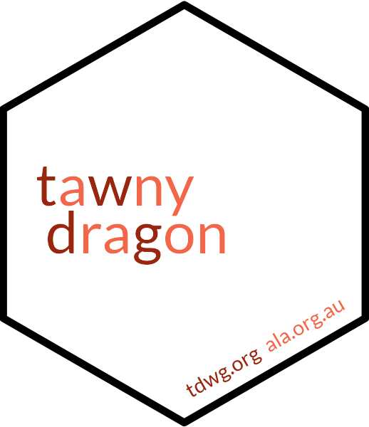

<!-- README.md is generated from README.Rmd. Please edit that file -->

```{r, echo = FALSE}
knitr::opts_chunk$set(
  collapse = TRUE,
  comment = "#>",
  fig.path = "vignettes/README-"
)
```

# tawnydragon 

**Easy Biodiversity Information Standards**

The [Biodiversity Information Standards](http://www.tdwg.org) Group - commonly
known as TDWG - develops and standards for sharing biodiversity information.
`{tawnydragon}` is a fast and tidy R interface to those standards.

The package name refers is one common name for *Ctenophorus decresii*, a species 
whose common name happens to contain all of the letters in TDWG (albeit not in 
order!)

To install from GitHub:
```{r eval=FALSE}
install.packages("remotes")
remotes::install_github("AtlasOfLivingAustralia/tawnydragon")
```
